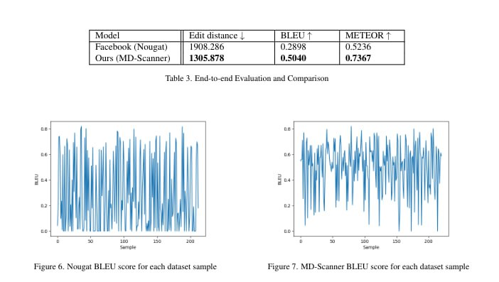

# MD Scanner Code Monorepo

MD-Scanner is a Computer Vision Pipeline that generate accurate Markdown files from document images. Notably, it seems to performs better than Meta AI's [Nougat](https://facebookresearch.github.io/nougat/).

## Repository Contents

This repository contains all of the code we wrote for the MarkDown Scanner, except for some Section Classification-specific code. Those things are in [this repository](https://github.com/md-scanner/unilm). There you can also find the [`pipeline.py` file](https://github.com/md-scanner/unilm/blob/master/dit/pipeline.py) running the whole pipeline except the preprocessing step.

For dataset generation, there a lot of shell scripts (some are Bash-specific, some others are not) meant to run on UNIX-like environments.

Other requirements are:

* for the `md-retriever`: Python 3 and some packages (TODO `requirements.txt`).
* for the `md-renderer`: ImageMagick and:
    1. Pandoc and the themes from [this repository](https://github.com/cab-1729/Pandoc-Themes) and associated fonts for the MD->Latex->PDF->JPG conversion (no BBs generated), using the `gen_pdfs.sh` shell script.
    2. Docker (and an active Internet connection to allow it to fetch images remotely) for the MD->HTML->PDF->JPG/PNG conversion (with generated BBs), using the `main.sh` Bash script.
* for the `bb-extractor`: CMake, a C++ toolchain, OpenCV and its development headers;
* for `to-coco-format`: Python 3 and `pandas`

**NOTE: You can find the latest training checkpoints for our models and the generated DB in the repository [releases](https://github.com/md-scanner/md-scanner/releases).**

## Steps to generate the dataset

* retrieve Markdown files from the GitHub API using `md-retriever`;
* generate images from those Markdown files using `md-renderer`;
* extract bounding box coordinates to CSV files using `extract-bbs`.

To convert the dataset to (PubLayNet-like) COCo format by generating a JSON file from the CSVs, use `to-coco-format`. 

## Resources:
- PubLayNet (Jupyter Notebook): https://github.com/ibm-aur-nlp/PubLayNet/blob/master/exploring_PubLayNet_dataset.ipynb
- PubLayNet: https://arxiv.org/pdf/1908.07836.pdf
- FUNSD: https://arxiv.org/pdf/1905.13538.pdf

